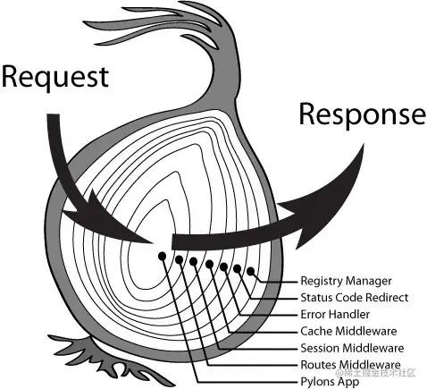

# 前言

之前都觉得写博客有点浪费时间，但一段时间的学习下来，没有写点总结，总感觉没怎么掌握。举个实在的例子，为了解决某个问题打开搜索引擎，找到一段代码能够解决当前的问题，于是就复制粘贴，然后改一改，然后这件事就过去了，下次再遇到这个问题的时候，很大的概率已经忘记了要怎么解决了，即使记得自己解决过这个问题，但当光标聚焦到编辑器的时候，还是觉得无从下手。

所以从这篇博客开始，希望自己能够养成写博客进行记录总结的习惯。

# 什么是洋葱模型？

我们可以把一次完整的事件想象成穿过一颗洋葱🧅，大家都知道洋葱是一层一层的，所以事件穿过洋葱实际上也就是给这个事件执行的过程中加点中间加工的过程，每层洋葱都可以看作是一次加工，这种加工的过程也可以被称为==中间件==。



## 举个例子

我们常用的axios的拦截器其实也可以看作一个洋葱模型。请求拦截器相当于事件执行过程中相对于“洋葱心”的前段部分，而响应拦截器就相当于其后段部分了。

```js
// 请求拦截器
axiosInstance.interceptors.request.use((config) => {
  console.log(config); // {} 未经修改的请求配置
  config.name = "leaon";
  return config;
})
axiosInstance.interceptors.request.use((config) => {
  console.log(config); // { name: 'leaon' }
  config.age = 100;
  return config;
})
// 响应拦截器
axiosInstance.interceptors.response.use((res) => {
  console.log(res.config) // { name: 'leaon', age: 100 } 请求拦截器和响应拦截器中的config其实是同一个对象
 	res.data = '111'
  return res;
})
axiosInstance.interceptors.response.use((res) => {
  console.log(res) // { data: '111', ...}
  return res;
})
```

# 实现简易的洋葱模型

## 类构建

洋葱模型的构建可以看作是给即将开始的事件执行添加一层一层的中间件。我们可以把这种类型的模型抽象成一个类。如下所示，我们创建了一个`Onion`类，目前所需的成员变量`middlewares`就是用来存储该实例所被添加的所有中间件。我们可以用`use(fn)`方法来给实例进行中间件的添加。

`action`方法就是用来进行中间件的执行，逻辑也很简单，就是递归进行中间件的方法执行。

```js
// onion.js
const action = function(instance, context) {
  if (!instance.middlewares.length) return;
  
  let index = 1;
  
  function next() {
    const nextMiddleware = instance.middlewares[index];
    if (nextMiddleware) {
      index ++;
      nextMiddleware(context, next);
    }
  }
  // 开始执行第一个中间件
  instance.middlewares[0](context, next)
}

class Onion {
  middlewares = [];
  // 挂载中间件
  use(fn) {
    this.middlewares.push(fn);
  }
  // 启动
  listen(port) {
    console.log('该进程执行在端口:' + port);
    Promise.resolve({}).then(ctx => {
      action(this, ctx)
    })
  }
}

module.exports = Onion;
```

## 使用

完成了洋葱模型的类构建，我们可以通过实例进行该模型的使用。

```js
const Onion = require('./onion.js')

const onion = new Onion;

onion.use(async (ctx, next) => {
  console.log(1);
  console.log('ctx:', ctx);
  await next();
  console.log('ctx:', ctx);
  console.log(2);
})

onion.use(async (ctx, next) => {
  console.log(3);
  ctx.name = 'ysj';
  await next();
  console.log('ctx:', ctx);
  console.log(4);
})

onion.use(async (ctx, next) => {
  console.log(5);
  console.log(ctx)
  ctx.age = 23;
  await next();
  console.log('ctx:', ctx);
  console.log(6)
})

onion.listen(3000); // 启动
```

我们在上面给洋葱模型实例添加了三个中间件，首先通过`listen`方法会对第一个中间件进行执行。在之后的所有中间件中，到`next`方法的时候就会进入下一层中间件，层层递归。按照这样的逻辑进行打印出的结果应当如下所示

```js
该进程执行在端口:3000
1
ctx: {}
3
5
{ name: 'ysj' }
ctx: { name: 'ysj', age: 23 }
6
ctx: { name: 'ysj', age: 23 }
4
ctx: { name: 'ysj', age: 23 }
2
```

